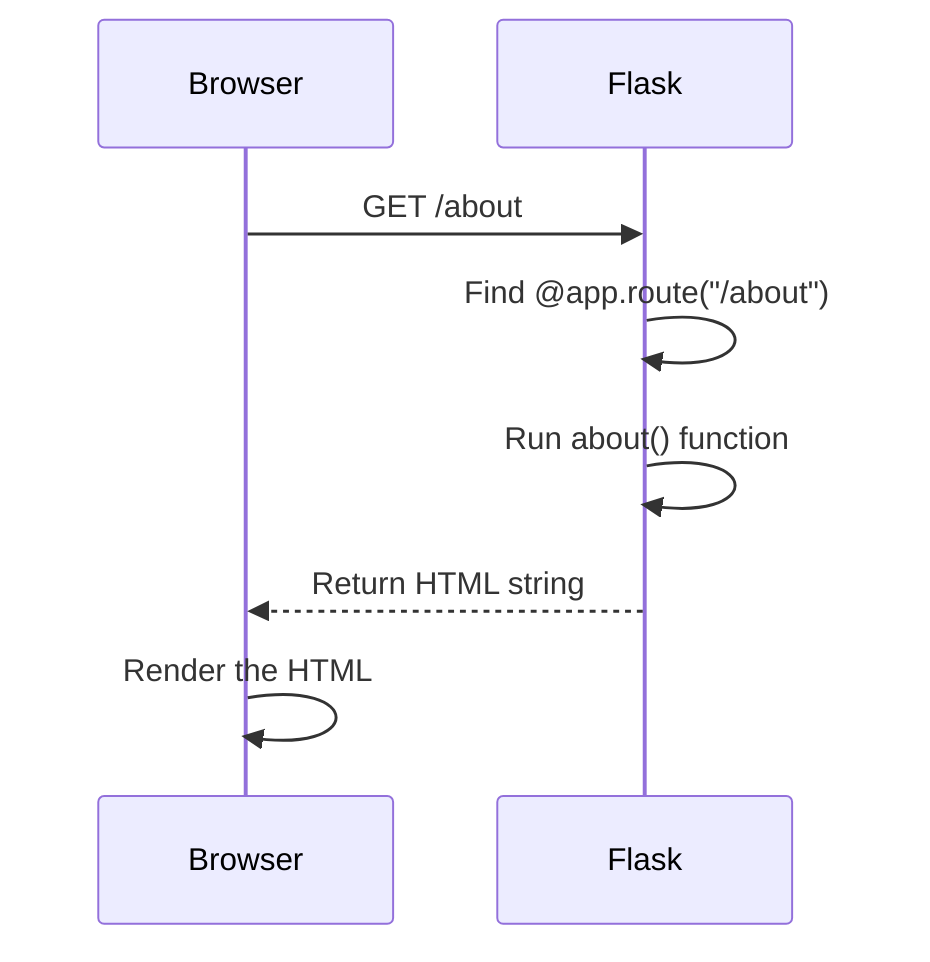

# Routes and URLs

A Flask app is a collection of routes. Each route maps a URL path to a Python function.

## Adding more routes

Your first route handles `/`. Adding a second route is the same pattern:

```python
@app.route("/about")
def about():
    return "<h1>About Me</h1><p>I like Python.</p>"

@app.route("/tasks")
def tasks():
    return "<h1>My Tasks</h1><ul><li>Learn Flask</li><li>Build a web app</li></ul>"
```

Each `@app.route` creates a new URL. Save the file, and with `--debug` running, the new pages appear immediately.

:::alert{info}
Each route function must have a **unique name**. If you name two functions the same thing, Python silently overwrites the first one. You won't get an error — just a missing page.
:::

## Route variables

You can capture part of the URL as a variable:

```python
@app.route("/greet/<name>")
def greet(name):
    return f"<h1>Hello, {name}!</h1>"
```

Now visiting `/greet/Alice` displays "Hello, Alice!" and `/greet/Bob` displays "Hello, Bob!"

The angle brackets `<name>` in the route string become a parameter in the function. Flask extracts the value from the URL and passes it in.

This is the first time you're seeing a URL as something *parsed* rather than just typed.

## Linking between routes

Right now, users have to manually edit the URL bar to navigate. Fix this with HTML links:

```python
@app.route("/")
def index():
    return """
    <h1>Welcome</h1>
    <nav>
        <a href="/about">About</a> |
        <a href="/tasks">Tasks</a> |
        <a href="/greet/World">Greet</a>
    </nav>
    """
```

The `<a href="/about">` tag creates a clickable link. The browser sends a new HTTP request for `/about`, Flask runs the `about()` function, and the response comes back.

## The request-response cycle

Every time you click a link or type a URL:



This happens for every single page load. There's no state between requests — each one is independent.
